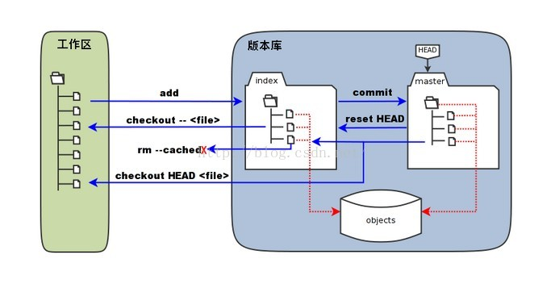

# Tools(工具)

---

## command line 命令行

---

### basic-commmand 基础命令

> 以后如无特殊表示, 命令行均用 Cmder工具

```shell
# pwd (point working directory 指向工作目录)
$ pwd

# ls (List information about the FILEs 列出当下文件)
$ ls
$ ls -l  # long information 详细信息
$ ls -la # 长格式 all 文件
$ ls -lh #把字节大小转换为B M
$ ls -lt #默认修改的时间time排序
$ ls -ltr #revers 倒过来时间修改排序
$ ls -R 文件名 # 递归方式显示文件名下的所有子目录信息

# tree 树型显示目录
$ tree dir_name

# 清屏
$ clear

# cd (change directory)
$ cd directoryName
$ cd ../ # 上一级
$ cd ~ # 主目录 (cmder无  )

# mkdir (make directory 创建目录文件夹)
$ mkdir directoryName 
$ mkdir project\app\css # 自动创建补充其父目录

# mv (move 移动)
$ mv test\01\001 test\02\ # mv 要移动的文件 要移动到的位置
$ mv -v test\01\001 test\02\ # 显示结果信息
$ mv cess.txt hello.txt # 重命名文件名

# touch 创建触摸初始化文件
$ touch ts.txt
$ touch file-{01..10}.txt # 批量创建文件

# rm 删除
$ rm *.txt

# cp copy复制
$ 

# expLorer 探险,探索,资源管理器, -连字符 _属性
$ explorer # 打开资源管理器
$ explorer G:\learn_note\test # 在资源管理器中打开文件夹
$ explorer .git #在资源管理器中打开当前目录下的这个文件夹
```

---

## git (分布式版本控制系统)

Linux之父Linus在02年花了两周写了Git, 成为了流行的分布式版本控制系统, 08年Github上线后免费提供git存储, 几乎一统江湖, 目前所有人的共识是git是最好用的, 且开源.

集中式的工作方式是联网, 从服务商下载, 干完活把作品推过去
分布式的不但可以互相推送, 也可以用其中一个作为服务器(交换中心)推送

CVS是最早且开源的集中式, 提交问题较多, SVN也是开源的集中式, 目前用的最多,修复了前者一些问题

```shell
$ ssh-keygen -t rsa -C "gaolushaobing@gmail.com" # 生成SSH 
```

然后在用户主目录里找到`.ssh`目录，里面有`id_rsa`和`id_rsa.pub`两个文件，这两个就是SSH Key的秘钥对，id_rsa是私钥，不能泄露出去，id_rsa.pub是公共, 提交在Git仓库




git的大部分工作是把文件在工作区,暂存区和版本库中移来移去, 例如`git add`是把文件从工作区复制到暂存区, `git commit`又把文件从暂存区复制/提交到版本库

> 暂存去的概念优点类似于 选择商品 -> 购物车 -> 结账 中 购物车的概念, 可以多次选择多次提交,并且可以多次改变处理悔改后再提交
> **暂存区**的设计也是和SVN的一大区别


### help 帮助信息

```shell
$ git help # 查看帮助信息, 有一些常用的指令和解释
$ git help -a # 查看所有命令
$ git help -g # 简单的使用手册目录 attributes everyday etc.
$ git help attributes #弹出本地html页面显示attributes详细内容
$ git help add #弹出本地页显示add指令文档 
$ git clone # 克隆地址
```

> 目前版本的git是新弹出html页面, 之前文档信息显示在控制台, 翻页B 退出Q

---

### config 配置信息

安装了git以后一般是要配置下, 作者, 邮箱, 浏览器等等; 可以使用 `$ git help config` 指令查看详细文档, 只不过文档太长了.

配置有三种范围, 首先是`系统范围`, 不论哪个用户登录, Git都会用这个系统范围的配置, 针对计算机登录用户的范围是`global(全局范围)`,大部分是用此配置, 此外还有`项目范围`

```shell
$ git config --global user.name 'Kevin' # 配置用户名
$ git config --list # 查看配置信息
$ git config --unset --global user.name # 重置 
$ git config --global user.email 'gaolushaobing@gmail.com' 
$ git config --global color.ui true # 彩色显示git
$ cat ~/.gitconfig # 查看根目录下的配置文件
```

---

### init (initialize 初始)

若用git控制项目, 首先是要先初始化, 初始的是一个空的版本库 

git会把创建和需要的文件都放在生成的`.git`文件里, 有了它以后, git就会跟踪和监听这个`.git`所在目录的文件的变化, 这样就git就可以进行版本控制

`.git`文件里面一般不需要手动操作, 如果不想跟中目录, 可以删除`.git`文件夹

```shell
# 首先创建一个文件夹
$ mkdir movietalk
movietalk/$ git init # 初始化一个空的 .git 文件
```

---

### commit (提交) 流程

一个提交的流程: 项目修改变动 => 告诉git要提交修改的哪些文件 => 确认提交 => 提交时添加描述信息

```shell
# 查看状态
$ git status # 查看目前状态
  -> On branch master # 当天所在分支是 master(主分支'控制 主要 大师')
  -> No commits yet # 还没有提交

# 新建/修改文件后(在工作区内)
$ git status
  -> Untracked files: # 此时会显示未被跟踪(暂存)的文件

# 添加到暂存区
$ git add index.html # 添加要跟踪的文件到暂存, 添加所有文件是 git add .

$ git status
  -> Changes to be committed: # 主分支上尚未提交, 要提交的更改的信息:

# 提交到版本库
$ git commit -m '添加index.html文件' #cmder貌似不能有空格

# 再次查看
$ git status # 没有可提交的 工作目录是干净的

# 查看以往提交 查看提交日志(版本库日志)
$ git log
  commit a78fec5191f9fd1e99193421b234432d268d6d10 (HEAD -> master)
  Author: Kevin <gaolushaobing@gmail.com>
  Date:   Fri Aug 3 15:33:51 2018 +0800
    // 提交信息
```

---

### diff different 

diff比较的是暂存区与工作区之间的不同,

```shell
# 修改文件后查看文件状态 (tools.md)
$ git status # modified修改的文件 还未暂存
$ git diff tools.md # 查看修改前后的区别, 加文件就是该文件明细, 不加就是所有
$ git add 01_tools/tools.md
$ git diff --staged ## 查看暂存区和版本库之间的区别
```

---

### rename 重命名

```shell
# 在编辑器里重命名文件后, 会提示删除了一个文件, 然后新增了未跟踪文件
$ git status
$ git rm style.css
$ git add theme.css
```

---

### mv 重命名或者移动

```shell
$ git mv theme.css tongyaojia.css
# 修改名字会在暂存区, 可以直接提交修改
# git不跟踪文件夹, 除非此文件夹包含文件, 也就是说git不会跟踪空白目录
# 可以创建文件夹然后移动文件
$ git mv tongyaojia.css 01_tools/css
$ git mv tongyaojia.css 01_tools/css
```


